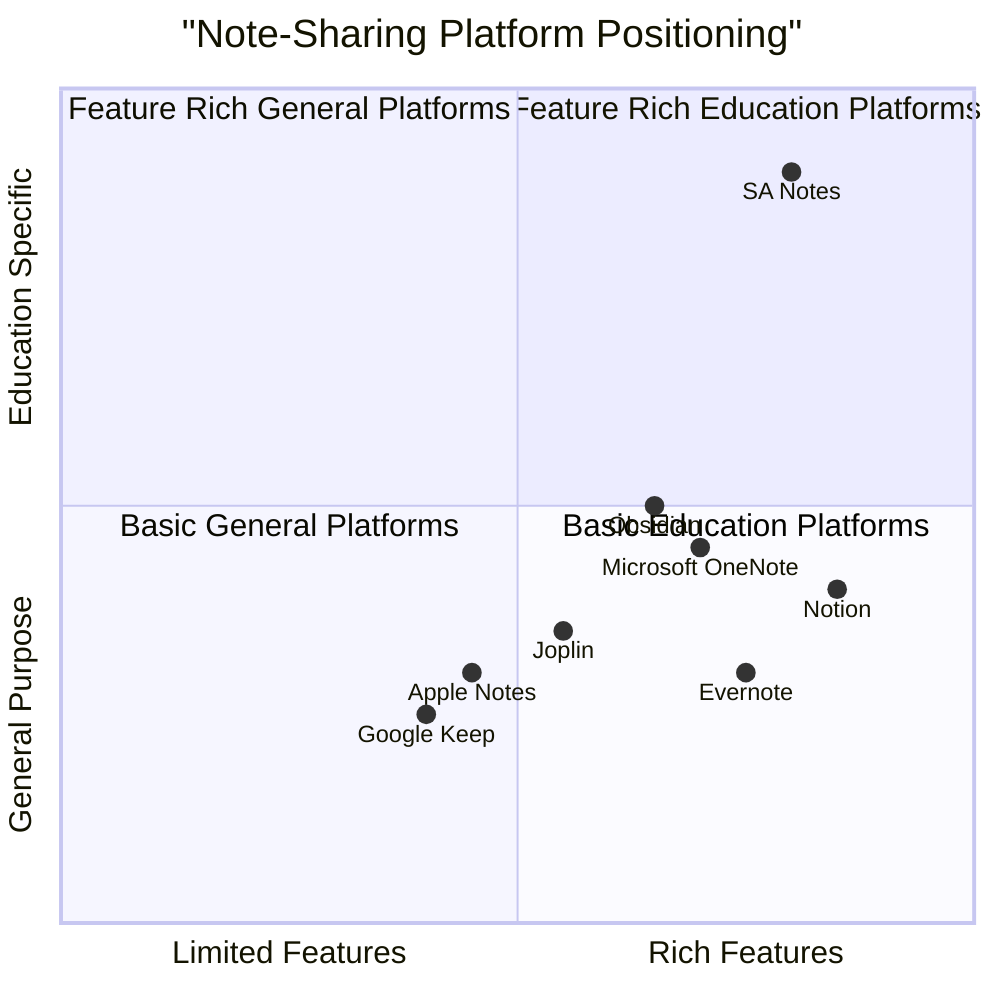
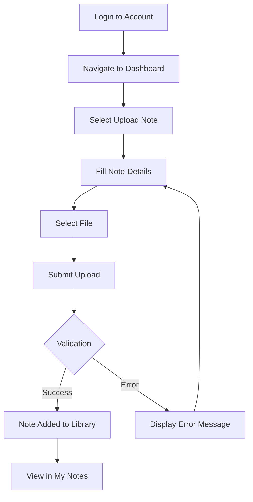
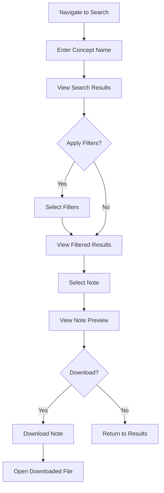
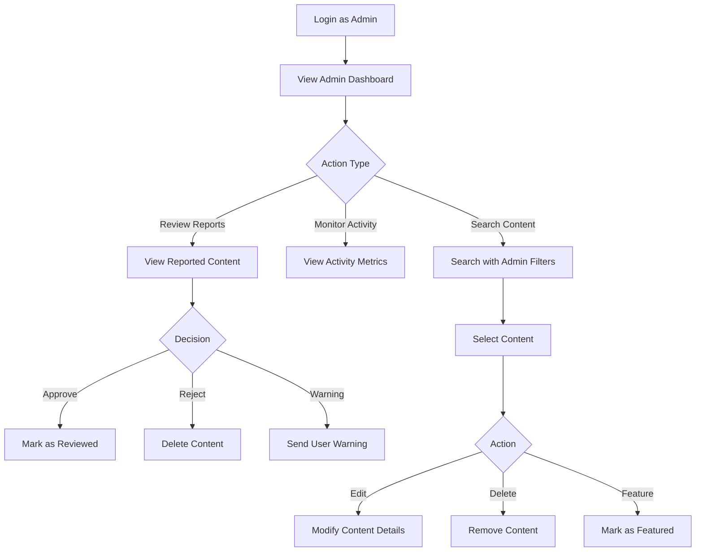

# SA Notes - Product Requirements Document (PRD)

*Version 1.0 - August 2nd, 2025*

## 1. Executive Summary

SA Notes is a user-driven online platform designed to revolutionize the way students share, discover, and interact with educational notes. The platform allows users to upload, access, and manage educational content while integrating with Google search to help users find external resources based on concept names directly from the site. SA Notes aims to create a collaborative learning environment with a user-friendly interface that works seamlessly across all devices.

### 1.1 Problem Statement

Students currently face several challenges when it comes to note-sharing and study materials:
- Difficulty finding quality educational resources for specific concepts
- Disorganized storage of educational materials across multiple platforms
- Limited ability to share and collaborate on notes with peers
- Lack of personalized recommendations for study materials
- Time-consuming process to search for concept explanations across multiple sources

SA Notes addresses these pain points by providing a centralized, user-friendly platform for sharing and discovering educational content.

### 1.2 Product Vision

SA Notes will be the go-to platform for students seeking to improve their learning experience through collaborative note-sharing, intelligent search capabilities, and personalized content recommendations. The platform will support users across their educational journey with features that enhance discovery, organization, and engagement with study materials.

## 2. Market Analysis

### 2.1 Market Overview

The global education technology (EdTech) market is experiencing significant growth, valued at approximately USD 163.49 billion in 2024 and projected to reach USD 348.41 billion by 2030, growing at a CAGR of 13.3%. The North American market currently dominates with a 35.62% revenue share in 2024, while the K-12 sector leads market segments with 39.40% of revenue share.

### 2.2 Key Market Trends

1. **Personalization**: Growing demand for personalized learning solutions
2. **AI Integration**: Increasing use of AI and data analytics in educational tools
3. **Mobile Learning**: Rising popularity of mobile-first educational platforms
4. **Collaborative Learning**: Shift toward virtual collaboration and knowledge sharing
5. **Digital Materials**: Growing adoption of e-books and digital learning materials
6. **Lifelong Learning**: Increased focus on continuous professional development

### 2.3 Competitive Analysis

#### 2.3.1 Direct Competitors

| Competitor | Strengths | Weaknesses | Differentiation |
|------------|-----------|------------|----------------|
| Microsoft OneNote | Cross-platform, rich text formatting, free version | Limited collaboration features, complex for beginners | Strong integration with Microsoft ecosystem |
| Notion | Highly customizable, database capabilities, templates | Steep learning curve, performance issues with large databases | All-in-one workspace beyond just notes |
| Obsidian | Knowledge linking, offline access, customizable | Primarily text-based, limited multimedia support | Focus on knowledge connections and PKM |
| Joplin | Open-source, privacy-focused, markdown support | Less polished UI, limited real-time collaboration | Strong privacy and security focus |
| Evernote | Organization tools, web clipper, multi-format support | Expensive premium tier, feature bloat | Established market presence |

#### 2.3.2 Indirect Competitors

1. **Learning Management Systems** (Canvas, Blackboard)
2. **File Storage Services** (Google Drive, Dropbox)
3. **Study Group Platforms** (Discord, Slack education communities)

#### 2.3.3 Competitive Quadrant Chart

#### 2.3.4 Key Differentiators for SA Notes

1. **Education-Specific Focus**: Unlike general note-taking apps, SA Notes is specifically designed for educational content sharing and discovery
2. **Integrated Google Search**: Unique capability to search both platform content and external sources
3. **Community-Driven**: Emphasizes collaboration and sharing among students
4. **Specialized Features**: Features like note rating, concept-based search, and educational categorization
5. **User-Friendly Design**: Emphasis on intuitive UI with educational context in mind

## 3. User Personas

### 3.1 Primary User: College Student (Sarah)

**Demographics:**
- 20-year-old undergraduate student
- Studies Computer Science
- Tech-savvy but values simplicity

**Goals:**
- Find quality study materials for difficult concepts
- Share her well-organized notes with classmates
- Discover new learning resources efficiently
- Organize her study materials in one place

**Pain Points:**
- Wastes time searching for explanations across multiple sites
- Struggles to find quality materials for specific concepts
- Has notes scattered across different platforms
- Limited budget for paid educational resources

**Usage Scenarios:**
- Uploads her detailed algorithm notes before finals
- Searches for "machine learning basics" when struggling with a new concept
- Downloads PDF notes on database design before an exam
- Bookmarks resources for future reference

### 3.2 Secondary User: High School Teacher (Mark)

**Demographics:**
- 35-year-old high school science teacher
- Moderately tech-savvy
- Values quality and accuracy of educational content

**Goals:**
- Share supplementary materials with students
- Find diverse teaching resources for classroom use
- Organize subject-specific content for different classes
- Ensure students have access to quality learning materials

**Pain Points:**
- Limited time to create all teaching materials from scratch
- Difficulty finding age-appropriate content for specific topics
- Needs reliable sources to recommend to students
- Struggles with organizing digital resources

**Usage Scenarios:**
- Uploads lesson summaries after each class
- Creates curated collections of resources for specific units
- Reviews and rates notes on scientific concepts for accuracy
- Uses the platform to recommend specific resources to students

### 3.3 Admin User: Content Moderator (Alex)

**Demographics:**
- 28-year-old with background in education
- Highly tech-savvy
- Detail-oriented and committed to content quality

**Goals:**
- Ensure platform content meets quality standards
- Identify and remove inappropriate or plagiarized content
- Support users with technical or content-related issues
- Maintain a positive learning community

**Pain Points:**
- Needs efficient tools to review large volumes of content
- Requires visibility into user reporting patterns
- Needs clear metrics to identify problematic content or users
- Balancing content moderation with encouraging participation

**Usage Scenarios:**
- Reviews flagged content for potential removal
- Monitors trending searches to identify content gaps
- Analyzes user engagement metrics to improve platform features
- Responds to user reports about content quality

## 4. Product Requirements

### 4.1 Feature Prioritization Matrix

#### P0 - Must Have (Phase 1)

| Feature | Description | Justification |
|---------|-------------|---------------|
| User Authentication | Email/password registration and login with verification | Core security feature |
| Note Upload & Management | Ability to upload, edit and delete notes | Primary platform function |
| Basic Search | Search notes by concept name or tags | Core discovery mechanism |
| User Dashboard | Personal space to manage uploaded notes | Essential user experience |
| Responsive Design | Website that works on mobile, tablet, and desktop | Accessibility requirement |
| Dark/Light Theme | Toggle between visual themes | Basic personalization |
| Admin Panel | Basic moderation capabilities | Content quality control |

#### P1 - Should Have (Phase 2)

| Feature | Description | Justification |
|---------|-------------|---------------|
| Google Search Integration | External search results for concepts | Key differentiator |
| Advanced Search Filters | Filter by subject, level, file type, date | Improves discovery |
| Note Rating & Feedback | Star ratings and comments on notes | Quality signal |
| Bookmarking | Save notes to personal library | Enhances user retention |
| Note Preview | See content preview before downloading | Improves user experience |
| Categorization & Tagging | Organize notes into folders with tags | Better organization |
| Basic Analytics | View statistics on note engagement | User insights |

#### P2 - Nice to Have (Phase 3)

| Feature | Description | Justification |
|---------|-------------|---------------|
| AI-Powered Suggestions | Predictive search and smart tags | Advanced personalization |
| Note Versioning | Track updates to notes | Power user feature |
| PDF Annotation Tools | Highlight and annotate notes in browser | Enhanced engagement |
| Bulk Upload & ZIP Extraction | Upload multiple files at once | Convenience feature |
| Email Notifications | Alerts for bookmarked note updates | Engagement driver |
| QR Code Sharing | Share notes via scannable codes | Novel sharing mechanism |
| Text-to-Speech | Read notes aloud for accessibility | Accessibility enhancement |

#### P3 - Future Considerations (Phase 4+)

| Feature | Description | Justification |
|---------|-------------|---------------|
| AI Summarization | Generate summaries of long notes | Advanced AI feature |
| Cloud Storage Integration | Connect with Google Drive/Dropbox | Extended ecosystem |
| Two-Factor Authentication | Enhanced security option | Security enhancement |
| Dynamic Themes | Multiple theme presets beyond dark/light | Personalization luxury |
| Collaborative Editing | Real-time collaborative note editing | Complex feature |
| Multi-language Note Viewer | AI translation of notes | International expansion |

### 4.2 Detailed Feature Specifications

#### 4.2.1 User Authentication

**Requirements:**
- Sign up with email, username, and password
- Email verification via sent link
- Secure login with email/password
- "Forgot Password" and "Resend Verification" options
- User role assignment (Regular and Admin)
- JWT or Session-based authentication

**User Flow:**
1. User enters registration details
2. System validates inputs and creates account
3. Verification email is sent to user
4. User clicks verification link to activate account
5. User can now log in with credentials

#### 4.2.2 Note Upload & Management

**Requirements:**
- Upload notes in multiple formats (PDF, DOCX, TXT)
- Add title, description, tags, and concept name
- Edit note details after upload
- Delete notes from personal library
- File size limits and type restrictions

**User Flow:**
1. User navigates to upload section
2. User fills note metadata and selects file
3. System validates and processes upload
4. Note appears in user's personal library
5. User can edit or delete as needed

#### 4.2.3 Search Functionality

**Requirements:**
- Basic search by concept name or keywords
- Display relevant notes from the platform
- Google search integration for external results
- Advanced filters (subject, educational level, file type, date)
- Sort options (relevance, date, rating)

**User Flow:**
1. User enters search term in search bar
2. System returns matching notes from platform
3. System displays related external results (when Google integration is active)
4. User can apply filters to refine results
5. User selects a note to view details

#### 4.2.4 User Dashboard

**Requirements:**
- Welcome message and profile information
- Upload notes section
- My Notes section with management options
- Search interface
- Theme toggle control
- Analytics on personal note engagement

**User Flow:**
1. User logs in and is directed to dashboard
2. User can see their uploaded content
3. User can navigate to upload, search, or settings
4. User can track engagement with their content
5. User can manage profile information

#### 4.2.5 Admin Panel

**Requirements:**
- Secure access with admin credentials
- View all uploaded notes
- Edit or delete any note
- Search and filter by user, concept, or tag
- Dashboard with platform statistics
- Content moderation tools

**User Flow:**
1. Admin logs in with special credentials
2. Admin is directed to admin dashboard
3. Admin can view platform metrics
4. Admin can search and filter content
5. Admin can take moderation actions on content

#### 4.2.6 Design & UI Requirements

**Requirements:**
- Primary background color: rgb(254, 177, 177) (#feb1b1)
- Minimalistic, modern UI with playful fonts
- Smooth animations and transitions
- Icon-based actions for common functions
- Modal or slide-in forms for interactions
- Fully responsive layout (mobile, tablet, desktop)
- Dark and light mode toggle with persistent preference
- Consistent visual language across all pages

## 5. User Flows

### 5.1 Core User Flow: Note Upload

### 5.2 Core User Flow: Note Search and Download

### 5.3 Admin Flow: Content Moderation

## 6. Technical Specifications

### 6.1 Frontend Technologies

- **HTML5** for document structure
- **CSS3** with Tailwind CSS for styling
- **JavaScript** with TypeScript for enhanced development
- **React** as the primary frontend framework
- **Shadcn-ui** for UI components
- **Responsive Design** approach for all screen sizes
- **Local Storage** for theme preferences and user settings

### 6.2 Backend Technologies

- **Node.js** for server-side runtime
- **Express.js** for API framework
- **MySQL** for database management
- **JWT** for authentication
- **Nodemailer** for email verification
- **Multer** for file uploads
- **Google Custom Search API** for external search integration

### 6.3 Hosting & Infrastructure

- **Cloud Hosting** with scalable resources
- **CDN** for static assets and faster global delivery
- **Secure File Storage** for uploaded notes
- **SSL** for secure communications
- **Automated Backups** for data protection

### 6.4 API Requirements

1. **Authentication API**
   - Registration, login, verification, password reset

2. **Notes API**
   - CRUD operations for notes
   - Search, filter, and recommendation endpoints

3. **User API**
   - Profile management, settings, analytics

4. **Admin API**
   - Content moderation, user management, analytics

5. **External API Integration**
   - Google Custom Search API

## 7. Non-Functional Requirements

### 7.1 Performance

- Page load time under 2 seconds for core pages
- Search results returned in under 1 second
- Support for up to 10,000 concurrent users
- File upload handling for files up to 20MB
- Responsive UI with no perceptible lag

### 7.2 Security

- HTTPS for all connections
- Secure password hashing
- JWT with appropriate expiration
- File scanning for malicious content
- Protection against XSS and CSRF attacks
- Rate limiting for API endpoints
- Input validation for all user submissions

### 7.3 Scalability

- Horizontal scaling capability
- Database sharding strategy for growth
- Caching layer for frequently accessed content
- CDN integration for global reach
- Efficient resource utilization

### 7.4 Accessibility

- WCAG 2.1 AA compliance
- Screen reader compatibility
- Keyboard navigation support
- Color contrast adherence
- Text resizing without loss of functionality
- Alternative text for all images

### 7.5 Compliance

- GDPR compliance for European users
- COPPA considerations for educational context
- Clear terms of service and privacy policy
- Copyright and fair use guidelines for uploads
- Data retention and deletion policies

## 8. Success Metrics

### 8.1 User Engagement Metrics

- **Monthly Active Users (MAU)**: Target 50,000+ in first year
- **Note Uploads**: 5,000+ monthly uploads
- **Search Queries**: 100,000+ monthly searches
- **Average Session Duration**: 10+ minutes
- **Return Rate**: 40%+ users return within 7 days

### 8.2 Content Quality Metrics

- **Note Ratings**: 80%+ notes with 4+ star ratings
- **Download Rate**: 50%+ of viewed notes are downloaded
- **Report Rate**: Less than 5% of notes reported for quality issues
- **Content Diversity**: Notes across at least 20 subject areas

### 8.3 Platform Growth Metrics

- **User Growth Rate**: 15%+ month-over-month
- **Content Growth Rate**: 20%+ month-over-month increase in notes
- **Search Coverage**: 90%+ of searched concepts return at least 3 results
- **Conversion Rate**: 5%+ of visitors register for accounts

### 8.4 Technical Performance Metrics

- **Uptime**: 99.9%+ availability
- **Average Page Load Time**: Under 2 seconds
- **API Response Time**: Under 200ms for 95% of requests
- **Error Rate**: Less than 1% of requests result in errors

## 9. Development Roadmap

### 9.1 Phase 1 - MVP (Months 1-3)

- Basic user authentication
- Core note upload/management functionality
- Simple search capability
- User dashboard
- Admin panel with basic moderation
- Responsive design with dark/light theme
- Essential security features

### 9.2 Phase 2 - Enhanced Features (Months 4-6)

- Google search integration
- Advanced search filters
- Note rating and feedback system
- Bookmarking functionality
- Note preview capability
- Improved categorization and tagging
- Basic analytics dashboard

### 9.3 Phase 3 - Advanced Capabilities (Months 7-9)

- AI-powered search suggestions
- Note versioning
- PDF annotation tools
- Bulk upload capabilities
- Email notification system
- QR code sharing
- Accessibility enhancements

### 9.4 Phase 4 - Future Expansion (Months 10+)

- AI summarization
- Cloud storage integration
- Enhanced security features
- Additional theme options
- Collaborative editing features
- Language translation capabilities

## 10. Open Questions and Considerations

1. **Content Moderation Scale**: As the platform grows, how will we scale content moderation effectively?

2. **Copyright Concerns**: What policies and technical measures should be implemented to address potential copyright issues with uploaded content?

3. **Monetization Strategy**: Should future versions consider premium features or other monetization approaches to sustain the platform?

4. **Mobile App Consideration**: Should we develop native mobile apps in addition to the responsive web platform?

5. **Integration Ecosystem**: Which additional third-party integrations would provide the most value to users?

6. **AI Implementation Details**: What specific AI technologies should we leverage for the smart features planned in later phases?

7. **Educational Institution Partnerships**: Should we develop specific features to partner with schools and universities?

## 11. Conclusion

SA Notes aims to create a transformative educational resource-sharing platform that addresses the needs of students and educators by providing a centralized hub for quality notes and learning materials. By focusing on user-friendly design, powerful search capabilities, and community-driven content, SA Notes will position itself as a unique solution in the educational technology landscape.

This PRD outlines the vision, requirements, and development approach for creating a platform that not only meets current user needs but also establishes a foundation for future growth and innovation in educational content sharing.